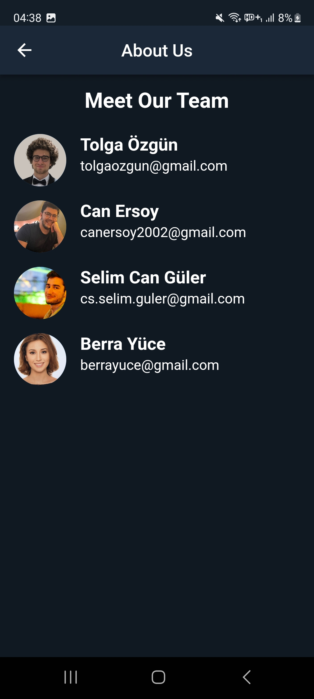

# Voluntracker
Voluntracker is a project aimed at providing efficient organization and coordination for community relief efforts during times of crisis, with a focus on Goal 11: Sustainable Cities and Communities and Target 11.b. The goal is to create a platform that brings community members together to effectively help each other during times of crisis, such as the devastating earthquakes that hit the Turkey-Syria region in February 2023.

The earthquake's aftermath highlighted the lack of organization and coordination in the relief efforts, which led to inefficiencies in the distribution of volunteers and supplies to help centers. As volunteers in the earthquake relief efforts, the team members of Voluntracker experienced the challenges of tracking and managing the needs of multiple help centers, resulting in some centers being overwhelmed with volunteers while others struggled with insufficient support.

To address this issue, Voluntracker aims to create an application that streamlines the organization efforts at help centers, making it easier for volunteers to find the right centers to help and for help centers to efficiently manage their needs for supplies, equipment, and physical labor. The platform will provide a central hub for communication and coordination among volunteers and help centers, reducing reliance on external tools like WhatsApp and Google Spreadsheets.

By leveraging technology to improve the efficiency of community relief efforts, Voluntracker aims to make a positive impact in times of crisis and contribute towards achieving Goal 11 and Target 11.b of Sustainable Development Goals. The project is driven by first-hand experiences of the team members who have witnessed the challenges of relief efforts and aims to make a meaningful contribution towards more effective community response during times of crisis. Join us in our mission to create a more efficient and coordinated approach to community relief efforts with Voluntracker. Let's make a difference together!

Our main product is our Android application, which you can find under releases, but you can check out our web application  in a really early stage at [voluntracker.app](https://voluntracker.app). In the near future, we will be releasing our iOS and macOS applications as well.

## Table of Contents

- [Google Technologies Used](#google-tech-used)
- [Features](#features)
- [Screenshots](#screenshots)
- [Installation](#installation)
- [Usage](#usage)
- [Contributing](#contributing)
- [License](#license)
- [Authors](#authors)
- [Contact Us](#contact-us)

## Google Technologies Used

- Firebase
  - Firebase Cloud Messaging
  - Firebase Storage
  - Firebase Crashlytics
  - Firebase Analytics
- Google ML Kit
  - Face Detection
  - Image Labeling (not implemented yet, under development)
  - Barcode Scanning (not implemented yet, under development)
- Flutter
- Google Maps API
- Google Cloud
  - Cloud Build
  - Cloud SQL
  - Cloud Run

## Features
Voluntracker's role hierarchy is as follows: Admin > Help Center Coordinator > Team Leader > Volunteer. This means that Admins can do everything that Help Center Coordinators are able to do, Help Center Coordinators can do everything that Team Leaders can do, and Team Leaders can do everything Volunteers can do.

### Volunteer Features
  - See Help Center List: Volunteers can list the registered help centers, filter them by their name and city and sort them according to their name, city or distance to their location (if their GPS signal is on). 
  - View Help Center Map: Volunteers are able to see the help centers on the map and they can get brief information about the help center by pressing the markers. 
  - Follow Help Centers: Users can follow help centers which will appear on landing page so that they will access these centers quickly. Moreover, we plan to implement notification feature based on followed help centers.
  - Upload Profile Picture: Users are able to upload a profile picture of their own which will be displayed to other users.
  - See Help Center Needs: One of the most important features of Voluntracker is to allow the users to keep track of needed volunteer counts and needed suppyly counts of the help center in order to reduce miscommunication and increase coordination. Therefore, the users are able to see what needed are required at the help centers, how many, what is the urgency and when was the last time a need is updated.

### Team Leader Features
  - Assign Volunteer To Team: Team leaders can see volunteers that are assigned to their help centers and they can assign these volunteers to their team. 
  - See Team Details: Team Leaders are able to see the details of their team and manage it.
  
### Help Center Coordinator Features
  - Manage Teams: Coordinators are allowed to see a list of the teams of their help center and they can manage these teams such as assigning a volunteer to a team as well as assigning a team leader to this team. They are also allowed to created a new team as well.
  - Update Help Center Needs: Coordinators can update needed volunteers and needed supplies at their help centers as well as creating new need requests. They can also update other details of their help center such as busiest hours and open close hours.

### Admin Features:
  - Create Help Center: Admins can create a new help center and add it to the database.
  - Manage Users: Admins can assign coordinators and volunteers to the help centers.

### Features that we plan to implement in the feature
  - Certificate System: We are planning to allow the coordinators to give certificates to volunteers after they complete a set of training provided by the officials.
  - Supply Truck Tracking System: After supplies are gathered at the help centers, they are distributed to required locations. We will implement a tracking system such that the officials will be able to which location will recieve how many supplies etc. 
  - Registration with QR System: Currently volunteers are assigned by their emails or phone numbers and we plan to implement a QR system which allows the users to join to a team or a help center by directly scanning a QR code.
  - Notification of New Needs: Currently the volunteers are able to follow help centers and we aim to add a notification feature such that whenever a new need (either supply or volunteer) is needed at one of the help centers the volunteer is following, they will receive a notification about it.

## Screenshots

| Welcome Page | Signup Page | Login Page | Forgot Password Page |
| ------------ | ------------ | ------------ | ------------ |
|  |  |  |  |
| Volunteer Home Page | Help Centers List | Help Center Details | Profile |
|  |  |  |  |
| Edit Profile Page | Map | Map Help Center Details | Volunteer Teams List |
|  |   |  |  |
| Volunteer Team Details | Volunteer Team Detail Options | Assign Volunteer To Team | Assign Team Leader |
|  |  |  |  |
| Remove Volunteer | Create Help Center Page | Help Center Details | Needed Supply List |
|  |  |  |  |
| Update Help Center Details | Needed Volunteers List | Needed Volunteer Creation | Needed Supply List |
|  |  |  | |
| Contact Us| About Us |
|  |   | 


## Installation

To get started with the project, please follow these steps:

1. Clone the repository:

   git clone https://github.com/CanErsoy20/voluntracker.git

### Frontend

2. Install Flutter through the [official guide](https://docs.flutter.dev/get-started/install). Also install an emulator through the guide if you aren't planning to use on a physical device.

3. Install the dependencies:

```
   cd frontend
   flutter pub get
```

4. Add Google Maps API Key

   Navigate to: frontend\android\app\src\main\AndroidManifest.xml. Change API_KEY_HERE with your API key from Maps SDK for Android.

```
        <meta-data android:name="com.google.android.geo.API_KEY"
               android:value="API_KEY_HERE"/>

```

5. Follow the [official Flutter run instructions]() to run either on an emulator or a physical device. 
Or you can build the project on following architectures:

- [Android](https://docs.flutter.dev/deployment/android)
- [iOS](https://docs.flutter.dev/deployment/ios)

### Backend

Building a server is not mandatory, but if you are planning on building your server instance follow these steps:

2. Install Node.js and NPM through the [official guide](https://docs.npmjs.com/downloading-and-installing-node-js-and-npm). Here is the link to [official downloads](https://nodejs.org/en/download).

3. Install the project dependencies:
```
   cd backend
   npm install
```

4. Set up environment variables:

   Place an .env file in the root directory of the project. The file should contain the following variables:

   ```
      DATABASE_URL=
      NODE_ENV=DEV
      JWT_ACCESS_SECRET=
      JWT_REFRESH_SECRET=
      FIREBASE_PROJECT_ID=
      FIREBASE_PRIVATE_KEY=
      FIREBASE_CLIENT_EMAIL=
      FIREBASE_DATABASE_URL=
   ```
   For database URL, you can use the following template or check out [Prisma documentation](https://www.prisma.io/docs/reference/database-reference/connection-urls):
   ```
      postgres://<username>:<password>@<host>:<port>/<database>
   ```

   For Firebase variables, you can check out [Firebase documentation](https://firebase.google.com/docs/admin/setup#initialize-sdk) or you can download the service account key from Firebase console.
   
   For JWT secret keys, using the [HMAC algorithm is recommended](https://jwt.io/introduction). Though, it will work with any kind of string.


5. Set up the database and start the development server:

   ```npm run start:migrate```

6. Change API URL in frontend

  Navigate to: frontend\lib\constants\api_constants.dart
  
  Change
  
 ``` static String baseUrl = "https://api.voluntracker.app/v1/"; ```
  
  to match your backend endpoint.


## Usage

To use the application, follow these steps:

1. Install the application on your Android or iOS device.
2. Open the application and create an account.
3. Log in to the application and start using it.

## Contributing

As this is a Google Solution Challenge project, we do not allow third-party contributions at this time.

## License

This project is licensed under the MIT License.

## Authors

- Berra Yüce [📧](berrayuce@gmail.com)[🌐]()[]()
- Can Ersoy [📧](canersoy2002@gmail.com)[🌐]()[]()
- Selim Can Güler [📧](mailto:cs.selim.guler@gmail.com)[🌐]()[]()
- Tolga Özgün [📧](mailto:tolgaozgunn@gmail.com)[🌐](https://tolgaozgun.com)[](https://github.com/tolgaozgun)

## Contact Us

Feel free to contact us via contact@voluntracker.app or you can use our private emails listed above.
